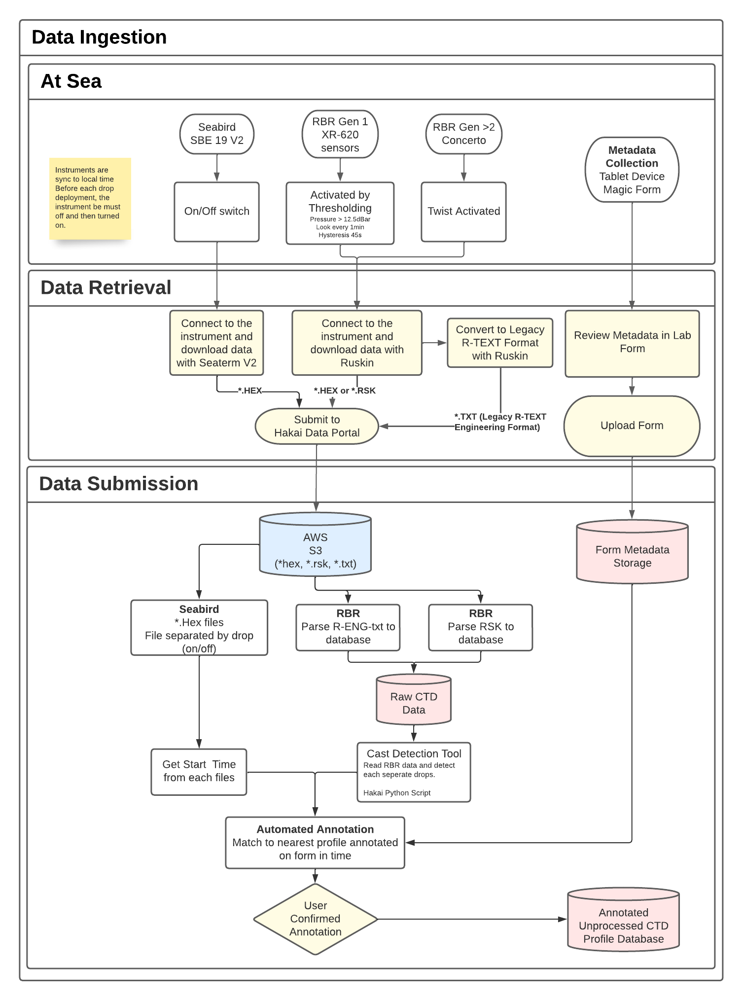

## Field Data and Metadata Upload

### Field Data Submission

Once a field survey completed, save and submit the field form. Retrieve the corresponding lab form within the associated lab tablet and review the different fields entered in the field. Confirm the metadata submitted and complete the final submission of the lab form.

Once submitted, those lab forms are sent to the Hakai Servers and integrated within our database.

### Instrument Data Submission

The data must be first downloaded from the CTD instruments following a survey through the manufacturer proprietary software ( see each respective [seabird](https://docs.google.com/document/d/1KFa8QB3JSkSBwPwUhb_FH8x_sM3v4mOx-pAeTz3_xDk/edit?usp=sharing) or [RBR](https://docs.google.com/document/d/1CdPT_7pTRghaBxCO5jRZT-BRfMDt4W194HIRs06M6A4/edit?usp=sharing) SOP manual for details)

Once downloaded, the data needs to be manually uploaded to the [Hakai Data Portal ](https://hecate.hakai.org/portal2) (if needed access request can be made [here](https://hecate.hakai.org/auth/access-request.php)). Follow the present procedure:

1. Log in with your authorized email account
2. Go to the [CTD Upload page](https://hecate.hakai.org/portal2/ctd/upload)
3. Select the appropriate Work Area
4. Drag and drop the files downloaded from the instruments
   - RBR \*.rsk file (likely a single file per survey)
   - RBR RText Engineering _.txt + _.hex file (only for older XR-620 units)
5. Confirm that upload was executed successfully

## Instrument Raw Data Ingestion

Once uploaded to the Hakai Server, the data is then copied and stored within the organization Amazon S3 bucket.

### RBR

#### RSK Conversion

RBR RSK format which is essentially an SQLite3 file which is following RBR's standard format is parsed to an R-Text equivalent file to be ingested within the Hakai Database.

The MatLab Hakai tool used to convert the RSK file can be here https://github.com/HakaiInstitute/hakai-data-tools/blob/master/ctd-tools/rbr-proc/RSK2HakaiJSON.m
The tool essentially is a wrapper around the [RSKTools MatLab package](https://rbr-global.com/support/matlab-tools/) developped by RBR. The tool reads the RSK file via the RSKopen and RSKreaddata functions which loads the RSK data into a MatLab environment structure.

The resulting structure is then stored as a json string within the header of the outputted file and the data stored as a table following the same convetioned used by the RText format.

The tool is deployed on the server as a docker container. This tool is used and compatible with both CTD and solo pressure gauge instruments.

#### RText Data Ingestion

RText or RSK converted data is then parsed and ingested into the Hakai database through the hakai-api tool https://github.com/HakaiInstitute/hakai-api/blob/main/src/routes/ctd/utils/rbr/parse.js

The tool rely on the RBR shortName convention to assigne each data column to the corresponding database table column within the `ctd.raw_ctd_data` table.

#### Cast Detection

The ["cast detection tool"](https://github.com/HakaiInstitute/hakai-api/blob/main/src/routes/ctd/utils/rbr/detectCasts.js) is a javascript algorithm that is used to detect and split RBR CTD timeseries data into separate profiles. The tool can be used in two modes:

1. Standard: The instrument is considered in the water if the conductivity exceeds the `0.95 mS/cm` threshold
2. Contain Static Casts: Essentially relies on time gaps to split the timeseries in multiple drops.

### Seabird

Seabird \*.hex files are considered been each associated to a unique drop and for this reason the conversion and ingestion process is performed at the very beginning of the [Seabird Data Processing](#Seabird-Data-Processing) step.

## Field Data and Metadata Annotation

All CTD drops uploaded to the Hakai Portal needs to be associated with a corresponding drop made available through the Metadata CTD Forms field during the survey by the field technicians.

To annotate drops associated with a survey:

1. Go to the Hakai Portal CTD Annotation page
2. Select the right work area
3. Select one or many uploaded files to be annotated
4. The server will try automatically to bring up the most likely associated drop provided within the Metadata CTD Forms.
5. Once matched to a drop metadata, the page will warm you if:
   a. The time difference between the form and the instrument detected drop start, (bottom, and end [RBR Only])
   b. The latitude and longitude distance recorded is more than a kilometer from the given station.
   c. The maximum depth reached by the instrument is significantly less or more than the target depth provided within the form.
6. Click `SAVE ANNOTATIONS` if the suggested annotation is appropriate
