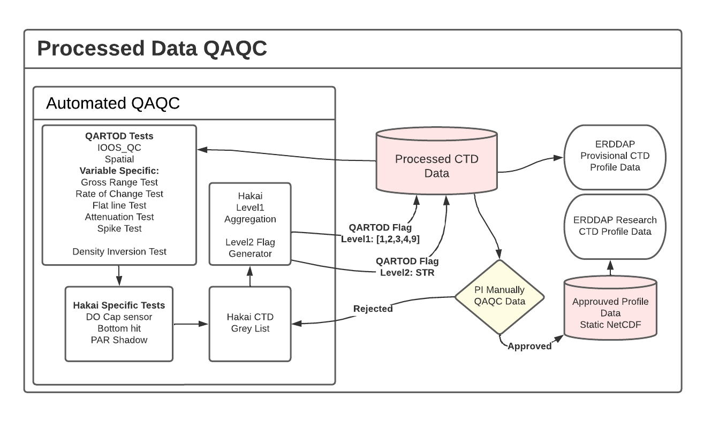

## Hakai CTD Data QA QC

Hakai uses a unique tool to automatically QC the CTD profile data. The QCing tool relies on the IOOS_QC packaged and a series of in-house tests.

The general QAQC workflow is summarized in the following diagram:

### Automated Data QA QC (provisional data)

The automated QC tool is available and maintained within the [hakai-profile-qaqc](https://github.com/HakaiInstitute/hakai-profile-qaqc) repository.

The tool runs essentially a series of tests available within the [IOOS QC package](https://github.com/ioos/ioos_qc) and a series of in-house tests.

The following configuration files are used to apply the different tests to each individual variable:

1. [IOOS QC Config](https://github.com/HakaiInstitute/hakai-profile-qaqc/blob/main/hakai_profile_qc/config/hakai_ctd_profile_qartod_test_config.json)
1. [Hakai Tests Configuration](https://github.com/HakaiInstitute/hakai-profile-qaqc/blob/main/hakai_profile_qc/config/hakai_ctd_profile_tests_config.json)
1. [Hakai Profiles Grey List](https://github.com/HakaiInstitute/hakai-profile-qaqc/blob/main/hakai_profile_qc/HakaiProfileDatasetGreyList.csv): Hakai's Grey List overwrite any flag values obtained through the different test for a given one.

For a more detailed description of the different tests applied, please refer to the [tests_description section](https://github.com/HakaiInstitute/hakai-profile-qaqc/blob/main/tests_description.md).

### Manual Review QA QC (research-ready data)

A Manual Review Process is completed by a designated person who reviews each individual profile and applies a flag to each individual variable profile. Only the data associated with an `AV` flag value are then considered and presented through the Hakai Research Dataset.

The Hakai manually QCed log is retrievable through the [Hakai Portal download](https://hecate.hakai.org/portal2/download) page as `CTD QC Tool` sample type and within the Hakai `ctd.ctd_qc` table within the Hakai Database.
