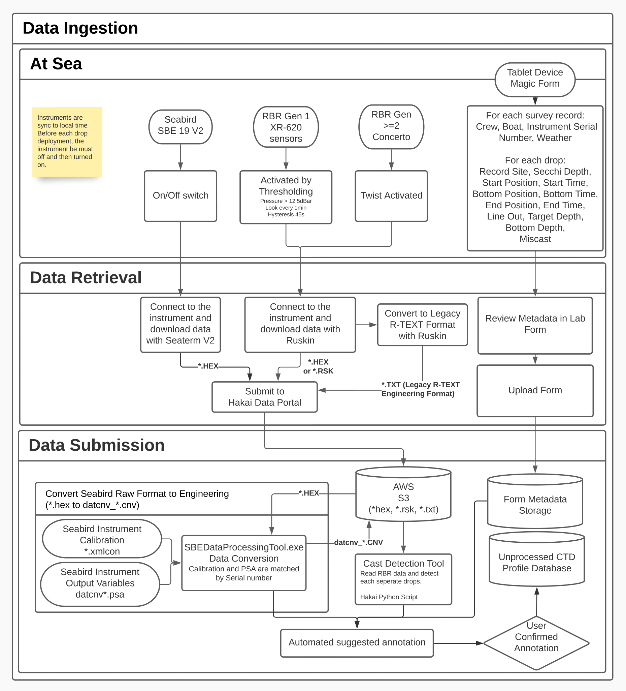
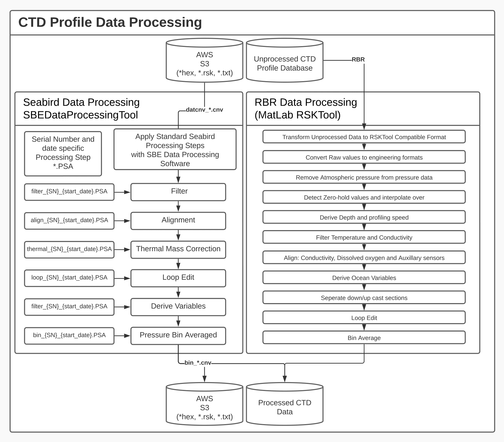

# hakai-ctd-processing-manual

This repository present and link the different components associated with the Hakai CTD Processing Workflow. Which is following the present pipeline:

---

## Field Data Collection

Data is first collected in the field by the field crew. The minimum required equipment is a CTD instrument unit and a tablet or phone (android or iOS) with the [Device Magic](https://www.devicemagic.com/) application installed on it linked to the Hakai Device Magic account.

### Field Metadata from form (Device Magic app)

Every time the field crew is leaving on a survey, a new `CTD form` should be created within their tablet. To which is added all the survey related information, all the drops completed during the survey including the miscasts ones should be added to the form as a drop.

Every drop must be associated with a start/bottom/end time, a station and a start/bottom/end location (highly recommended).

### CTD Instrument (RBR Maestro/Concerto/XR620 or Seabird 19V2)

Hakai workflow is compatible with two CTD instrument manufacturer and their respective following profiling instruments:

#### [Sea-Bird Scientific](www.seabird.com)

The compatible instruments include:

1. [SBE 19plusV2](https://www.seabird.com/sbe-19plus-v2-seacat-profiler-ctd/product?id=60761421596)
2. [SBE 911 plus](https://www.seabird.com/sbe-911plus-ctd/product?id=60761421595) (potentially)
3. [SBE 25 plus](https://www.seabird.com/sbe-25plus-sealogger-ctd/product?id=60429374753)) (potentially)

Hakai as of now only support the SBE 19V2 instrument, that been said, it would be possible to support with very little effort any other profiling instruments from the manufacturer. Please refer to the [Seabird 19plusV2 Standard Operation Protocol manual](https://docs.google.com/document/d/1KFa8QB3JSkSBwPwUhb_FH8x_sM3v4mOx-pAeTz3_xDk/edit?usp=sharing) for a more detailed walkthrough of the different steps associated with the use of the Seabird Instruments as recommanded by the Hakai Institute.

#### [RBR](www.rbr-global.com)

The compatible instruments include:

1. XR-620
2. Concerto (recommended Fast)
3. Maestro (recommended Fast)
4. [Concerto3](https://rbr-global.com/products/standard-loggers/rbrduo-ct/) (recommended Fast)
5. [Maestro3](https://rbr-global.com/products/standard-loggers/rbrmaestro/) (recommended Fast)

Please refer to the [Hakai RBR Instruments Standard Operation Protocol Manual](https://docs.google.com/document/d/1CdPT_7pTRghaBxCO5jRZT-BRfMDt4W194HIRs06M6A4/edit?usp=sharing) for a more detailed walkthrough of the different steps associated with the use of the RBR Instruments as recommened by the Hakai Institute.

### Bottle Mounted Pressure Gauges

The Hakai Institute uses small boats during is regular surveys which prevent the use of a larger rosette system for collecting water. Instead, Hakai relies on Niskin bottles of different volume mounted at different locations on a line to sample specific target depths.

The bottles are first lowered in the water column to reach the target depths. Once the bottles are the right depth, a messenger is sent from the surface to trigger sequentially the different bottles which each at their turn release another messenger which gets drop below that bottle to trigger the next bottle below.

In order to confirm the depth of each bottles when they get triggered, a small pressure gauge sensor ([RBR Solo](https://rbr-global.com/products/compact-loggers/rbrsolo/)) is mounted on each bottles and record the pressure associated with each bottle every seconds. This pressure data can be used to derive the associated depth of each bottle.

RBR Solo data is downloaded by the same software used by the RBR CTD instruments [Ruskin](https://rbr-global.com/products/software/)

### Field Data Storage

### Field Instrument Maintenance Forms

## Field Data and Metadata Upload

### Field Data Submission

Once a field survey completed, save and submit the field form. Retrieve the corresponding lab form within the associated lab tablet and review the different fields entered in the field. Confirm the metadata submitted and complete the final submission of the lab form.

Once submitted, those lab forms are sent to the Hakai Servers and integrated within our database.

### Instrument Data Submission

The data must be first downloaded from the CTD instruments following a survey through the manufacturer proprietary software ( see each respective [seabird](https://docs.google.com/document/d/1KFa8QB3JSkSBwPwUhb_FH8x_sM3v4mOx-pAeTz3_xDk/edit?usp=sharing) or [RBR](https://docs.google.com/document/d/1CdPT_7pTRghaBxCO5jRZT-BRfMDt4W194HIRs06M6A4/edit?usp=sharing) SOP manual for details)

Once downloaded, the data needs to be manually uploaded to the [Hakai Data Portal ](https://hecate.hakai.org/portal2) (if needed access request can be made [here](https://hecate.hakai.org/auth/access-request.php)). Follow the present procedure:

1. Log in with your authorized email account
2. Go to the [CTD Upload page](https://hecate.hakai.org/portal2/ctd/upload)
3. Select the appropriate Work Area
4. Drag and drop the files downloaded from the instruments
   - RBR \*.rsk file (likely a single file per survey)
   - RBR RText Engineering _.txt + _.hex file (only for older XR-620 units)
5. Confirm that upload was executed successfully

## Instrument Raw Data Ingestion

Once uploaded to the Hakai Server, the data is then copied and stored within the organization Amazon S3 bucket.

### RBR

#### RSK Conversion

RBR RSK format which is essentially an SQLite3 file which is following RBR's standard format is parsed to an R-Text equivalent file to be ingested within the Hakai Database.

The MatLab Hakai tool used to convert the RSK file can be here https://github.com/HakaiInstitute/hakai-data-tools/blob/master/ctd-tools/rbr-proc/RSK2HakaiJSON.m
The tool essentially is a wrapper around the [RSKTools MatLab package](https://rbr-global.com/support/matlab-tools/) developped by RBR. The tool reads the RSK file via the RSKopen and RSKreaddata functions which loads the RSK data into a MatLab environment structure.

The resulting structure is then stored as a json string within the header of the outputted file and the data stored as a table following the same convetioned used by the RText format.

The tool is deployed on the server as a docker container. This tool is used and compatible with both CTD and solo pressure gauge instruments.

#### RText Data Ingestion

RText or RSK converted data is then parsed and ingested into the Hakai database through the hakai-api tool https://github.com/HakaiInstitute/hakai-api/blob/main/src/routes/ctd/utils/rbr/parse.js

The tool rely on the RBR shortName convention to assigne each data column to the corresponding database table column within the `ctd.raw_ctd_data` table.

#### Cast Detection

The ["cast detection tool"](https://github.com/HakaiInstitute/hakai-api/blob/main/src/routes/ctd/utils/rbr/detectCasts.js) is a javascript algorithm that is used to detect and split RBR CTD timeseries data into separate profiles. The tool can be used in two modes:

1. Standard: The instrument is considered in the water if the conductivity exceeds the `0.95 mS/cm` threshold
2. Contain Static Casts: Essentially relies on time gaps to split the timeseries in multiple drops.

### Seabird

Seabird \*.hex files are considered been each associated to a unique drop and for this reason the conversion and ingestion process is performed at the very beginning of the [Seabird Data Processing](#Seabird-Data-Processing) step.

## Field Data and Metadata Annotation

All CTD drops uploaded to the Hakai Portal needs to be associated with a corresponding drop made available through the Metadata CTD Forms field during the survey by the field technicians.

To annotate drops associated with a survey:

1. Go to the Hakai Portal CTD Annotation page
2. Select the right work area
3. Select one or many uploaded files to be annotated
4. The server will try automatically to bring up the most likely associated drop provided within the Metadata CTD Forms.
5. Once matched to a drop metadata, the page will warm you if:
   a. The time difference between the form and the instrument detected drop start, (bottom, and end [RBR Only])
   b. The latitude and longitude distance recorded is more than a kilometer from the given station.
   c. The maximum depth reached by the instrument is significantly less or more than the target depth provided within the form.
6. Click `SAVE ANNOTATIONS` if the suggested annotation is appropriate

## CTD Data Standardized Data Processsing

Hakai follow the standard data processing procedures suggested by either the scientific community of the instrument manufacturer.

### RBR Data Processing

The Hakai RBR CTD Profiles standard processing procedure follows the recommandations provided within the Report [Guidelines for processing RBR CTD profiles](https://waves-vagues.dfo-mpo.gc.ca/library-bibliotheque/40578112.pdf) and RBR recommendations.

#### Static Deployment

A static deployment is a special case where the instrument has to be maintained at a specific location and depth for a minimum duration.

This type of deployment has been implemented to provide the ability to sample regions associated with very shallow waters.

To be considered as a static measurement, a sample needs to respect the following conditions:

1. The instrument needs to be **maintained at a specific location and depth for at least 2 minutes and 30 seconds** (We recommend leaving the instrument for at least 3 minutes).
2. The depth throughout that period can only vary by either 10cm, 33% of the depth or up to 1m, whichever is greater.
3. The instrument needs to be deeper than 10cm in the water.

#### Dynamic Deployment

The dynamic deployment corresponds to a profile measurement. For a more detailed description of the procedure as recommended by the Hakai Institute, please refer to the [Hakai CTD Profile Data Processing Manual](https://docs.google.com/document/d/1ARnOcHvuxj4usH8uhaMJyEGsSERe2cTW4V0jl5DUO00/edit?usp=sharing).

### Seabird Data Processing

## Hakai CTD Data QA QC

### Automated Data QA QC (provisional data)

### Manual Review QA QC (research ready data)
