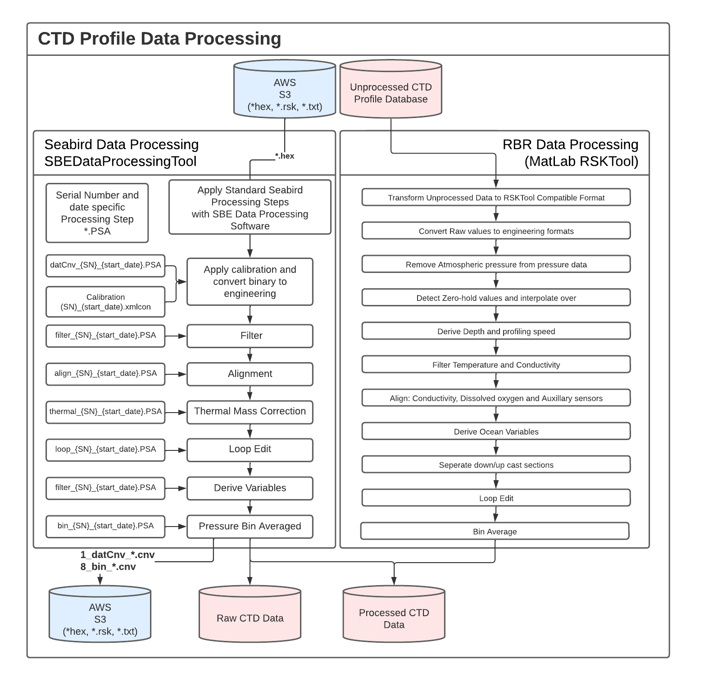

## CTD Data Standardized Data Processing

Hakai follows the standard data processing procedures suggested by either the scientific community or the instrument manufacturer.



### RBR Data Processing

The Hakai RBR CTD Profiles standard processing procedure follows the recommendations provided within the Report [Guidelines for processing RBR CTD profiles](https://waves-vagues.dfo-mpo.gc.ca/library-bibliotheque/40578112.pdf) and RBR recommendations.

<!-- markdown-link-check-disable -->
The main Matlab tool used to process Hakai RBR CTD profiles is maintained and available at [hakai-ctd-tools/ctd-tools/rbr-proc](https://github.com/HakaiInstitute/hakai-ctd-tools/tree/master/rbr-proc).

Where essentially the MatLab script [process_unprocessed_hakai_profiles.m](https://github.com/HakaiInstitute/hakai-ctd-tools/blob/master/rbr-proc/process_unprocessed_hakai_profiles.m) is run every 5 minutes on the Hakai server Hecate to retrieve and process the unprocessed profiles available within the Hakai database ctd.ctd_file_cast view through the API endpoint `/ctd/views/file/cast`:

Only the profiles respecting the [following API filter conditions](https://github.com/HakaiInstitute/hakai-ctd-tools/blob/0a86a152c53e5458313c498f961267248f6a492b/rbr-proc/process_unprocessed_hakai_profiles.m#L96) are processed:
<!-- markdown-link-check-enable -->

```matlab
filterURL = [
        'processing_stage=1_datCnv',...
        '&(status!=MISCAST|status=null)',....
        '&process_error=null',...
        '&device_model={XRX-620,RBRconcerto3,XR-620,RBRconcerto,RBRmaestro,RBRmaestro3}',...
        '&limit=-1'...
        ];
```

The resulting processed data is then uploaded back to the Hakai Database ctd.ctd_cast_data table and the processing_stage associated with each specific processed cast is updated to `processing_stage = '8_rbr_processed'`.

Any errors or warnings encountered are uploaded to:

- ctd.ctd_cast `processing_errors` column
- Sentry related project [rbr-proc](https://sentry.io/organizations/hakai-institute/projects/rbr-proc/?project=282260).

#### Static Deployment

A static deployment is a special case where the instrument has to be maintained at a specific location and depth for a minimum duration.

This type of deployment has been implemented to provide the ability to sample regions associated with very shallow waters.

To be considered a static measurement, a sample needs to respect the following conditions:

!!! note

        To be considered a static measurement, a sample needs to respect the following conditions:

        1. The instrument needs to be **maintained at a specific location and depth for at least 2 minutes and 30 seconds** (We recommend leaving the instrument for at least 3 minutes).
        2. The depth throughout that period can only vary by either 10cm, 33% of the depth or up to 1m, whichever is greater.
        3. The instrument needs to be deeper than 10cm in the water.

#### Dynamic Deployment

The dynamic deployment corresponds to a profile measurement. For a more detailed description of the procedure as recommended by the Hakai Institute, please refer to the [Hakai CTD Profile Data Processing Manual](https://docs.google.com/document/d/1ARnOcHvuxj4usH8uhaMJyEGsSERe2cTW4V0jl5DUO00/edit?usp=sharing).

### Seabird Data Processing

Hakai Seabird Data Processing workflow follows closely the recommendations provided by Sea-Bird within the [SBE Data Processing Manual](https://www.seabird.com/asset-get.download.jsa?code=251446). Hakai essentially uses a Python wrapper to interface the Seabird SBEDataProcessing software to run the different processing steps involved in the standard processing of the Seabird CTD data.

The Python wrapper to interface the Seabird SBEDataProcessing software maintained and available within the [hakai-ctd-tools/ctd-tools/seabird-proc/](https://github.com/HakaiInstitute/hakai-ctd-tools/tree/master/seabird-proc) repository.

The python wrapper match for a given SBE hex file, the related instrument serial number, and the closest xmlcon calibration file available within the [xmlcon files directory](https://github.com/HakaiInstitute/hakai-ctd-tools/tree/master/seabird-proc/xmlcon) prior to the collection date.

Once the data is converted from their raw hexadecimal data to the engineering format a series of processing steps are applied to the data by following the nearest in time prior processing parameter PSA files associated with this instrument serial number within the [PSA folder](https://github.com/HakaiInstitute/hakai-ctd-tools/tree/master/seabird-proc/psa).

Since the SBEDataProcessing Software is only available for Windows. The tool is run within a dedicated server hosted within the Hakai Victoria Wharf Street office.
