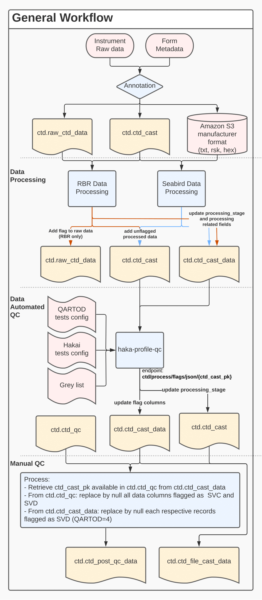

---
hide:
    - title
    - navigation
    - toc
---

This site present and link the different components associated with the Hakai CTD Processing Workflow. The Hakai Processing Pipeline can be divided in the following components:

1. [Field Collection](1-field-data-collection.md)
2. [Submission and Annotation](2-data-submission.md)
3. [Processing](3-data-processing.md)
4. [Quality Control](4-data-quality-control.md)
5. [Distribution](5-data-distribution.md)

The following diagram also summarized the different steps:

----

